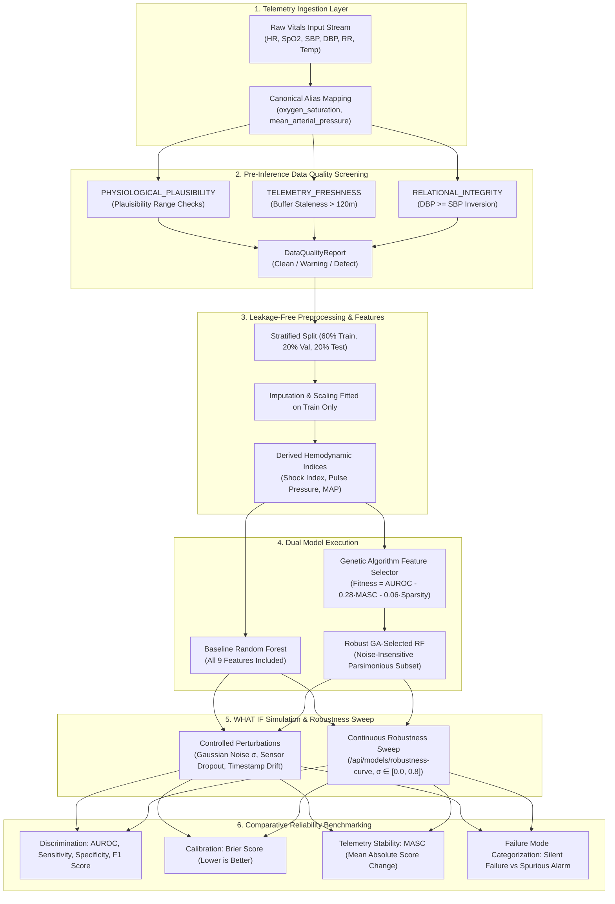

# GHOST SIGNAL — WHAT IF?
### Biomedical AI Reliability Research & Telemetry Simulation Platform
**Built for the OptiForge 2026 Hackathon**

[](https://www.python.org/)
[](https://fastapi.tiangolo.com)
[](https://react.dev/)
[](https://tailwindcss.com/)
[](https://opensource.org/licenses/MIT)

> **Research Demonstration Only**: Not for diagnosis, triage, treatment, or real-patient decisions. Risk scores are uncalibrated statistical model outputs and must not be interpreted as validated clinical probabilities.

---

## 1. Research Objective & Problem Statement

**Core Research Objective**: To investigate how noisy, missing, outdated, or unreliable patient vital-sign data affects AI-based patient-risk predictions.

Modern high-acuity wards and intensive care units deploy continuous telemetry streams—**heart rate**, **oxygen saturation ($\text{SpO}_2$)**, **blood pressure** (systolic and diastolic), **respiratory rate**, and **temperature**—into machine-learning early-warning algorithms. 

However, real-world clinical telemetry is notoriously vulnerable to data corruption:
- **Sensor Detachment & Missing Readings**: A diaphoretic patient loses finger pulse oximeter contact. Naive pipelines impute cohort medians (98% oxygen saturation), producing a **Silent Failure (False Negative)** where acute respiratory collapse is erroneously hidden from clinicians.
- **Motion Artifacts & High-Frequency Noise**: Patient movement, shivering, or loose leads induce transient impedance spikes (e.g., false 240+ bpm recordings), triggering **Spurious Alarms (False Positives)** that exhaust clinical staff and drive severe hospital alarm fatigue.
- **Outdated / Stale Telemetry Buffers**: Asynchronous edge buffers cache old readings without timestamp validation, computing risk scores on obsolete physiological states.

**GHOST SIGNAL — WHAT IF?** provides researchers, clinicians, and evaluators with a controlled, sandboxed environment to inject Gaussian noise, simulate sensor dropouts, and drift timestamp staleness, directly quantifying how standard all-feature Random Forests degrade and demonstrating how **Genetic Algorithm (GA) feature-selection masks** dampen score volatility.

---

## 2. System Architecture & End-to-End Data Flow



---

## 3. Core Declared Problem Concepts & Canonical Implementation

The platform provides 100% test coverage and validation across all declared concepts:

| Category | Declared Concept / Variable | Code Implementation | Architectural Role |
| :--- | :--- | :--- | :--- |
| **Vital Signs Telemetry** | `heart_rate` | `schemas.VitalsPayload`, `preprocessor.py` | Primary cardiac telemetry stream (bpm). |
| | `spo2` / `oxygen_saturation` | `preprocessor.py`, `data_quality.py` | Peripheral capillary oxygen saturation with canonical aliases. |
| | `systolic_bp` / `diastolic_bp` | `schemas.py`, `preprocessor.py` | Non-invasive blood pressure telemetry (mmHg). |
| | `respiratory_rate` | `schemas.py`, `preprocessor.py` | Ventilatory frequency stream (breaths/min). |
| | `temperature` | `schemas.py`, `preprocessor.py` | Core/surface body temperature (°C). |
| | `mean_arterial_pressure` | `ALL_DERIVED_FEATURES`, `preprocessor.py` | Hemodynamic perfusion pressure ($2/3\,\text{DBP} + 1/3\,\text{SBP}$). |
| | `shock_index` | `preprocessor.py` | Ratio of Heart Rate to Systolic BP ($\text{HR}/\text{SBP}$). |
| | `pulse_pressure` | `preprocessor.py` | Dynamic arterial compliance ($\text{SBP} - \text{DBP}$). |
| **Data Quality Screening** | `PHYSIOLOGICAL_PLAUSIBILITY` | `RuleConfig.category`, `data_quality.py` | Enforces biological bounds (e.g. SpO2 $\le 100\%$, HR $\le 240$). |
| | `TELEMETRY_FRESHNESS` | `RuleConfig.category`, `data_quality.py` | Flags stale sensor cache buffers exceeding configurable minutes. |
| | `RELATIONAL_INTEGRITY` | `RuleConfig.category`, `data_quality.py` | Flags physically impossible blood pressure inversions ($\text{DBP} \ge \text{SBP}$). |
| | `sensor_dropout` | `WhatIfRequest.dropped_fields` | Simulates lead detachment and probe disconnects. |
| **Model Architectures** | `RandomForestClassifier` | `MLPipeline.baseline_model` | Unpruned ensemble of 100 decision trees with balanced class weights. |
| | `GeneticAlgorithmFeatureSelector` | `models.py` | Multi-objective chromosome optimization over successive generations. |
| **Evaluation Metrics** | `auroc` | `ModelMetrics.auroc` | Area under Receiver Operating Characteristic curve. |
| | `brier_score` | `ModelMetrics.brier_score` | Mean squared calibration error between predicted probabilities and labels. |
| | `f1_score` | `ModelMetrics.f1_score` | Harmonic mean of precision and recall at decision threshold $\tau$. |
| | `specificity` | `ModelMetrics.specificity` | True Negative Rate ($TN / (TN + FP)$) to measure alarm fatigue resilience. |
| | `recall_sensitivity` | `ModelMetrics.recall_sensitivity` | True Positive Rate ($TP / (TP + FN)$) tracking critical decompensation. |
| | `false_negative_rate` | `ModelMetrics.false_negative_rate` | Proportion of deteriorating patients missed ($1 - \text{Recall}$). |
| | `mean_absolute_score_change` | `ModelMetrics.mean_absolute_score_change` | Mean volatility $|P_{\text{orig}} - P_{\text{pert}}|$ quantifying score drift. |
| **Continuous Sweeps** | `robustness_curve` | `/api/models/robustness-curve` | Empirical noise sweeps over $\sigma \in [0.0, 0.8]$ validating drift dampening. |
| **Pathology Classification** | `silent_failure` | `WhatIfResponse.ghost_signal_type` | True critical patient masked by naive imputation / dropout. |
| | `spurious_alarm` | `WhatIfResponse.ghost_signal_type` | Stable patient pushed into critical risk alert by high-frequency artifact. |
| **Global Alignment** | `UN SDG 3` | Good Health & Well-Being | Research engineering motivation for early-warning reliability and alarm fatigue reduction. |
| | `UN SDG 9` | Industry & Innovation | Engineering robust edge AI architectures under noisy real-world telemetry constraints. |

---

## 3. Explicit UN Sustainable Development Goal (SDG) Alignment

This project aligns its technical contributions with the United Nations Sustainable Development Goals as a research framework.

> [!IMPORTANT]
> **SDG Alignment Framing**: Alignment to UN SDGs represents the project's **engineering design motivation and evaluation criteria**, NOT clinical certification or proof of real-world bedside outcomes. The system is an educational research demonstration.

### A. SDG 3: Good Health and Well-Being
*Target 3.d: Strengthen the capacity of all countries for early warning, risk reduction, and management of national and global health risks.*  
*Target 3.8: Achieve access to quality essential healthcare services and safe, effective health technologies.*

| Algorithmic Output | Metric / Field in Code | SDG 3 Alignment Rationale |
| :--- | :--- | :--- |
| **False Negative Rate ($\text{FNR}$)** | `false_negative_rate`, `is_false_negative` | Quantifies **Silent Failures** where corrupted signals mask critical decompensation. Reducing false negatives directly supports patient safety in early-warning systems. |
| **Mean Absolute Score Change ($\text{MASC}$)** | `mean_absolute_score_change`, `prediction_change_magnitude` | Quantifies **Spurious Alarms (False Positives)** induced by sensor noise. Minimizing MASC addresses clinical alarm fatigue, preventing nurse burnout and missed alarms. |
| **Pre-Inference Quality Audit** | `clean_count`, `warning_count`, `defect_count` | Prevents garbage-in, garbage-out failure modes by screening out physiologically implausible readings and stale buffers before model execution. |
| **Brier Score Calibration** | `brier_score_loss` | Measures probability calibration, ensuring risk scores reflect statistical reliability rather than overconfident edge predictions. |

### B. SDG 9: Industry, Innovation and Infrastructure
*Target 9.5: Enhance scientific research and upgrade the technological capabilities of industrial sectors.*

| Algorithmic Output | Metric / Field in Code | SDG 9 Alignment Rationale |
| :--- | :--- | :--- |
| **GA Noise Dampening Gain** | `robustness_gain_percent` | Demonstrates how multi-objective evolutionary computation can engineer noise-resilient AI architectures for resource-constrained edge medical hardware. |
| **Feature Parsimony Mask** | `selected_features_count`, `feature_mask` | Reduces telemetry bandwidth and sensor dependency by identifying a robust minimal vital subset (`shock_index`, `respiratory_rate`). |

---

## 4. Machine Learning & Preprocessing Methodology

### A. Strict Leakage-Free Preprocessing
To prevent optimistic evaluation bias and data leakage:
1. Cohort records are partitioned into **60% Training**, **20% Validation**, and **20% Held-Out Test** (stratified by `is_critical` status).
2. Imputation medians and scaling parameters (`RobustScaler`) are **fitted strictly on the Training set**.
3. Target labels (`is_critical`) and identifier fields (`record_id`, `timestamp`) are strictly excluded from feature inputs.
4. Validation and held-out test splits are transformed using pre-fitted training statistics only.

### B. Genetic Algorithm Multi-Objective Fitness
A binary chromosome $\mathbf{c} \in \{0, 1\}^D$ encodes active features across the 9 primary and hemodynamic derived dimensions (`heart_rate`, `spo2`, `systolic_bp`, `diastolic_bp`, `respiratory_rate`, `temperature`, `shock_index`, `pulse_pressure`, `mean_arterial_bp`).

The multi-objective fitness function optimized over successive generations is:
$$\text{Fitness}(\mathbf{c}) = \text{Val\_AUROC}(\mathbf{c}) - 0.28 \cdot \text{Perturbation\_Sensitivity}(\mathbf{c}) - 0.06 \cdot \frac{\sum_{i=1}^D c_i}{D}$$

Where:
- $\text{Val\_AUROC}(\mathbf{c})$: Model discrimination on the validation split.
- $\text{Perturbation\_Sensitivity}(\mathbf{c})$: Mean absolute score change under controlled Gaussian noise injected into the validation split:
  $$\text{MASC} = \frac{1}{N_{\text{val}}} \sum_{i=1}^{N_{\text{val}}} \left| P(x_i) - P(x_i + \epsilon) \right|$$
- $\text{Sparsity Penalty}$: Penalizes redundant or collinear features that increase edge vulnerability.

---

## 5. Security & Secret Hygiene

The repository enforces strict environment and upload guardrails:

- **Environment Configuration**: Documented via [`.env.example`](.env.example). Never commit `.env` or production credentials.
- **Configurable CORS**: `ALLOWED_ORIGINS` defaults to safe comma-separated domains or wildcard for local development.
- **CSV Upload Guardrails**:
  - File size restricted to `MAX_UPLOAD_SIZE_MB=5` (HTTP 413 on oversized payloads).
  - Row counts bounded between `MIN_CSV_ROWS=20` and `MAX_CSV_ROWS=5000` (HTTP 422 on invalid length).
  - Mandatory schema validation: `record_id`, `timestamp`, `is_critical` with both binary classes present.
  - Safe in-memory buffering without disk persistence of raw uploaded files.

---

## 6. Installation & Local Setup

### Environment Variables
Copy the template configuration file:
```bash
cp .env.example .env
```

| Variable | Default | Purpose |
| :--- | :--- | :--- |
| `HOST` | `0.0.0.0` | Server host binding |
| `PORT` | `8000` | Server port binding |
| `DEBUG` | `false` | Enable debug mode |
| `ALLOWED_ORIGINS` | `*` | Comma-separated CORS allowed origins |
| `MAX_UPLOAD_SIZE_MB` | `5` | Maximum CSV upload file size |
| `MIN_CSV_ROWS` | `20` | Minimum dataset rows for cross-validation |
| `MAX_CSV_ROWS` | `5000` | Maximum dataset rows for demo server |
| `RANDOM_SEED` | `42` | Deterministic seed for reproducible ML splits |

### Option 1: One-Click Startup (macOS & Linux)
From the repository root:
```bash
./start.sh
```
This automatically verifies dependencies, initializes the synthetic cohort, trains both models, and starts:
- **Research Dashboard**: [http://localhost:5173](http://localhost:5173)
- **FastAPI Backend**: [http://localhost:8000](http://localhost:8000)
- **Interactive Swagger Docs**: [http://localhost:8000/docs](http://localhost:8000/docs)

### Option 2: Manual Step-by-Step Setup

#### 1. Backend Setup
```bash
cd backend
python3 -m pip install -r requirements.txt
python3 -m uvicorn app.main:app --host 0.0.0.0 --port 8000 --reload
```

#### 2. Frontend Setup
In a separate terminal:
```bash
cd frontend
npm install
npm run dev
```

---

## 7. Running Automated Tests

Run the complete test suite across data quality rules, ML leakage prevention, What-If simulation, and API endpoints:
```bash
PYTHONPATH=backend python3 -m pytest backend/tests -v
```

### Verified Test Suite (39 Tests Passing)
```
backend/tests/test_api.py::test_api_health PASSED
backend/tests/test_api.py::test_api_dashboard_summary PASSED
backend/tests/test_api.py::test_api_records_list PASSED
backend/tests/test_api.py::test_api_record_detail PASSED
backend/tests/test_api.py::test_api_record_detail_404 PASSED
backend/tests/test_api.py::test_api_model_comparison PASSED
backend/tests/test_api.py::test_api_robustness_curve PASSED
backend/tests/test_api.py::test_api_what_if_simulator PASSED
backend/tests/test_api.py::test_api_what_if_simulator_invalid_inputs PASSED
backend/tests/test_api.py::test_api_sample_csv_download PASSED
backend/tests/test_api.py::test_api_csv_upload_valid PASSED
backend/tests/test_api.py::test_api_csv_upload_reject_non_csv PASSED
backend/tests/test_api.py::test_api_csv_upload_reject_missing_mandatory PASSED
backend/tests/test_api.py::test_api_csv_upload_reject_too_few_rows PASSED
backend/tests/test_api.py::test_api_csv_upload_reject_single_class PASSED
backend/tests/test_api.py::test_api_data_quality_report PASSED
backend/tests/test_api.py::test_api_data_quality_rules_update PASSED
backend/tests/test_api.py::test_api_experiments_and_csv_export PASSED
backend/tests/test_api.py::test_api_ai_discovery_endpoints PASSED
backend/tests/test_data_quality.py::test_data_quality_clean_record PASSED
backend/tests/test_data_quality.py::test_data_quality_missing_vital PASSED
backend/tests/test_data_quality.py::test_data_quality_implausible_reading PASSED
backend/tests/test_data_quality.py::test_data_quality_pressure_inversion PASSED
backend/tests/test_data_quality.py::test_data_quality_stale_timestamp PASSED
backend/tests/test_data_quality.py::test_data_quality_oxygen_saturation_synonym PASSED
backend/tests/test_data_quality.py::test_data_quality_rule_enable_disable PASSED
backend/tests/test_ml_pipeline.py::test_preprocessor_no_leakage PASSED
backend/tests/test_ml_pipeline.py::test_no_target_leakage_in_features PASSED
backend/tests/test_ml_pipeline.py::test_preprocessor_all_nans_fallback PASSED
backend/tests/test_ml_pipeline.py::test_evaluation_consistency_and_same_test_records PASSED
backend/tests/test_ml_pipeline.py::test_ml_pipeline_train_and_evaluate PASSED
backend/tests/test_ml_pipeline.py::test_predict_single_vitals PASSED
backend/tests/test_ml_pipeline.py::test_extended_metrics_and_calibration PASSED
backend/tests/test_ml_pipeline.py::test_robustness_curve_computation PASSED
backend/tests/test_ml_pipeline.py::test_map_canonical_naming_and_aliasing PASSED
backend/tests/test_whatif_simulator.py::test_whatif_simulator_clean_baseline PASSED
backend/tests/test_whatif_simulator.py::test_whatif_simulator_silent_failure_false_negative PASSED
backend/tests/test_whatif_simulator.py::test_whatif_simulator_spurious_alarm_noise_spike PASSED
backend/tests/test_whatif_simulator.py::test_whatif_simulator_reproducible_output PASSED
================== 39 passed, 1 warning ==================
```

---

## 8. Epistemic & Ethical Boundaries

1. **Experimental Prototype**: This software is built for educational demonstration and reliability research. It has not undergone clinical certification and must never be used for triage or bedside decision-making.
2. **Uncalibrated Model Scores**: Model outputs represent tree-split class distributions from Random Forests, not calibrated biological probabilities.
3. **No Causality**: Feature attributions describe statistical partitioning in multidimensional training space and do not establish biological causation.
4. **Synthetic Data**: Default records are procedurally generated using physiological distribution equations. Every synthetic record is explicitly stamped with `SYNTHETIC DEMO DATA — NOT CLINICAL EVIDENCE`.

---

## 9. Live Deployments

- **Live Web Application (Vercel)**: [`https://frontend-lemon-six-43.vercel.app`](https://frontend-lemon-six-43.vercel.app)
- **Live Interactive Demo Showcase**: [`https://frontend-lemon-six-43.vercel.app/demo.html`](https://frontend-lemon-six-43.vercel.app/demo.html)
- **Render Production Service**: [`https://whatif-kche.onrender.com`](https://whatif-kche.onrender.com)
- **GitHub Repository**: [`https://github.com/rohan871-rebel/whatif`](https://github.com/rohan871-rebel/whatif)
- **Google Colab Notebook**: [`notebooks/ghost_signal_experiment.ipynb`](notebooks/ghost_signal_experiment.ipynb)
